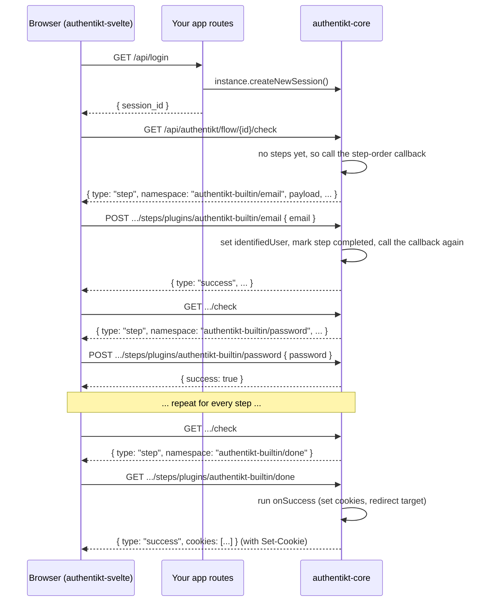

# How it works

This page explains the moving parts of authentikt and how a login travels between browser and server.

## Building blocks

<deflist>
<def title="Instance">

The object returned by `installAuthentikt { ... }`. It holds the resolved configuration and creates sessions. See
.

</def>
<def title="Session">

The state of one login attempt: which user has been identified, which steps have run, and arbitrary attributes. A
session is identified by a long random ID that the client keeps in the URL. See .

</def>
<def title="Step plugin">

A unit of the flow, such as "ask for a password". A plugin has a unique **namespace** (for example
`authentikt-builtin/password`), creates a fresh **state** object when the flow enters it, and installs the HTTP
routes the client talks to. See  and .

</def>
<def title="Step state">

A `BaseState` object per step and session. It answers two questions: *is this step completed?* and *what should
the client know about it?* (the **payload**).

</def>
<def title="Step-order callback">

The `authorization { session -> ... }` function. Whenever a step completes, authentikt asks it which plugin comes
next. See .

</def>
<def title="Client plugin">

The frontend counterpart of a step plugin, registered under the same namespace. It reads the payload, calls the
plugin's routes and renders UI. See .

</def>
</deflist>

## User identification is just a step

There is no special "user selection" phase. Identifying the user is done by an ordinary step plugin, such as
[`EmailUserSelectionPlugin`](email-plugin.md) or [`OIDCPlugin`](oidc-plugin.md), that sets
`session.identifiedUser`. Your step-order callback typically returns such a plugin as long as
`session.identifiedUser` is `null`.

This also means that you can put steps *before* user identification, for example a captcha or a terms-of-service
confirmation.

## Flow lifecycle

Step by step:

1. **Start.** Your application creates a session with `instance.createNewSession()` and returns its ID. The Svelte
   client writes the ID into the URL (`?_authentikt_flow_active=true&_authentikt_session_id=...`), so a reload or a
   redirect back from an external identity provider can resume the flow.
2. **Check.** The client asks `GET /flow/{id}/check` for the current step. On the first call, authentikt invokes
   your step-order callback to pick the first plugin and creates its state.
3. **Interact.** The client plugin for that namespace renders and sends requests to
   `/flow/{id}/steps/plugins/{namespace}`. The plugin route validates the input, replaces its state with a
   completed one and calls `session.nextStep()`. That runs the step-order callback again and pushes the next
   plugin onto the session.
4. **Repeat** until the callback returns the [`DonePlugin`](done-plugin.md). The client calls it once, and it runs
   your `onSuccess` handler to issue cookies or a redirect.

## Routes at a glance

All flow routes live under `{apiPrefix}/authentikt`:

| Route | Purpose |
|-------|---------|
| `GET  /flow/{sessionId}/check` | Current step, payload, public attributes and destination |
| `*    /flow/{sessionId}/steps/plugins/{namespace}/...` | Routes installed by each step plugin |
| `*    /static/plugins/{namespace}/...` | Session-independent routes (for example OIDC callbacks) |

When OAuth is configured, `/oauth/...` routes are added at the server root as well. The full contract is
documented in .
