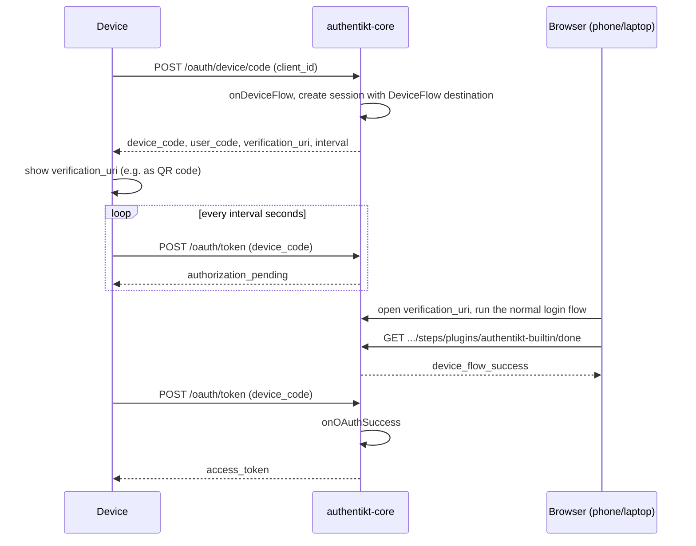

# OAuth and device flow

authentikt can act as a small OAuth 2.0 authorization server for your own applications. It supports the
**Device Authorization Grant** ([RFC 8628](https://datatracker.ietf.org/doc/html/rfc8628)): a TV app, a CLI or
another device without a comfortable keyboard shows a link, the user finishes the login on their phone or laptop
with your normal authentikt login page, and the device receives an access token.

## Enabling OAuth

Add an `oauth { }` block to `installAuthentikt`, and give your `DonePlugin` an `onOAuthSuccess` callback that
creates the token:

```kotlin
val donePlugin = DonePlugin<User> {
    onSuccess { session, user ->
        // regular browser logins
    }
    onOAuthSuccess { session, user ->
        OAuthAccessToken(
            accessToken = tokenService.issueFor(user, client = session.destination!!.applicationId),
            refreshToken = null,
            expiresIn = 7.days,
        )
    }
}

installAuthentikt<User> {
    // baseUrl, uiLoginBaseUrl, plugins, authorization { ... }

    oauth {
        onDeviceFlow { clientId ->
            if (clientId != "acme-tv-app") {
                return@onDeviceFlow OAuthDeviceFlowAuthorizationResult.Error("Unknown client")
            }
            OAuthDeviceFlowAuthorizationResult.Application(
                clientId = clientId,
                name = "ACME TV",
                deviceCode = Uuid.random().toString(),
                userCode = generateUserCode(),
            )
        }
    }
}
```

> When `oauth { }` is present, startup fails unless a `DonePlugin` with `onOAuthSuccess` is installed.
{style="note"}

The OAuth routes are mounted at the **server root** (`/oauth/...`), not under `apiPrefix`.

## Device flow

### Configuration

`onDeviceFlow { clientId -> OAuthDeviceFlowAuthorizationResult }`
: Called when a device requests a code. Validate the client ID and return either:

- `OAuthDeviceFlowAuthorizationResult.Application(clientId, name, deviceCode, userCode)`: `name` is shown on the
  login page, `deviceCode` is the secret the device polls with (make it long and random), and `userCode` is a
  short code for display.
- `OAuthDeviceFlowAuthorizationResult.Error(message)`: responds with `400` and the message.

Inside the block, `generateUserCode()` returns a random six-character code made of digits 1 to 9 and upper- and
lowercase letters.

### Sequence



1. The device calls `POST /oauth/device/code`. authentikt creates a session whose destination is
   `SessionDestination.DeviceFlow`.
2. The response contains a `verification_uri`. It points to `uiLoginBaseUrl` with the session ID in the query
   string, so opening it starts the login immediately. Show it as a link or QR code.
3. The user logs in. Your step-order callback runs as usual, and you can branch on
   `session.destination is SessionDestination.DeviceFlow` for stricter rules.
4. When the user reaches the `DonePlugin`, the browser gets `device_flow_success` and `onSuccess` is **not**
   called.
5. The device's next poll of `POST /oauth/token` runs `onOAuthSuccess` and returns the token. The device code can
   only be redeemed once.

On the login page, `auth.currentFlow.destination` contains the application name, so you can show "Signing in to
ACME TV":

```svelte
{#if auth.currentFlow?.destination.type === "device_flow"}
    <p>Signing in to <strong>{auth.currentFlow.destination.application_name}</strong></p>
{/if}
```

### Endpoints

#### POST /oauth/device/code

Form-encoded request:

| Parameter | Description |
|-----------|-------------|
| `client_id` | Client identifier, passed to `onDeviceFlow` |

Response:

```json
{
  "device_code": "1c0f8a1e-...",
  "user_code": "aB3xQ9",
  "verification_uri": "https://example.com/?_authentikt_flow_active=true&_authentikt_session_id=...",
  "verification_uri_complete": "https://example.com/?_authentikt_flow_active=true&_authentikt_session_id=...",
  "expires_in": 600,
  "interval": 5
}
```

#### POST /oauth/token

Form-encoded request:

| Parameter | Value |
|-----------|-------|
| `grant_type` | `urn:ietf:params:oauth:grant-type:device_code` |
| `device_code` | The `device_code` from the previous response |
| `client_id` | The same client ID |

Success response:

```json
{
  "access_token": "...",
  "token_type": "bearer",
  "expires_in": 604800,
  "refresh_token": null
}
```

Error responses (status `400`), as defined by RFC 8628:

| `error` | Meaning | What the device should do |
|---------|---------|---------------------------|
| `authorization_pending` | The user has not finished the login yet | Keep polling |
| `slow_down` | The device polled faster than the current interval | Add 5 seconds to the interval and keep polling |
| `expired_token` | Unknown device code, or already redeemed | Stop and start over |

Other grant types are answered with `400 Unsupported grant type`.

### Example device client

A minimal polling client with the Ktor HTTP client. `DeviceAuthorizationResponse`, `TokenResponse` and
`OAuthErrorResponse` are your own `@Serializable` classes that mirror the JSON above:

```kotlin
val device = client.submitForm(
    url = "https://example.com/oauth/device/code",
    formParameters = parameters { append("client_id", "acme-tv-app") },
).body<DeviceAuthorizationResponse>()

println("Open ${device.verificationUriComplete ?: device.verificationUri}")

var interval = device.interval.seconds
while (true) {
    delay(interval)
    val response = client.submitForm(
        url = "https://example.com/oauth/token",
        formParameters = parameters {
            append("grant_type", "urn:ietf:params:oauth:grant-type:device_code")
            append("device_code", device.deviceCode)
            append("client_id", "acme-tv-app")
        },
    )
    if (response.status == HttpStatusCode.OK) {
        val token = response.body<TokenResponse>()
        // store token.accessToken
        break
    }
    when (response.body<OAuthErrorResponse>().error) {
        "authorization_pending" -> continue
        "slow_down" -> interval += 5.seconds
        else -> error("Device login failed")
    }
}
```
