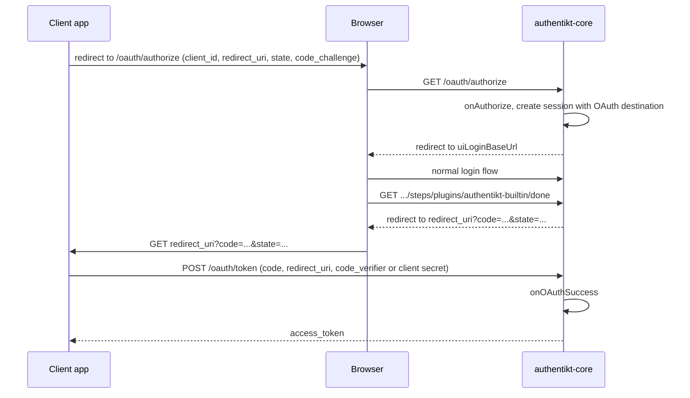
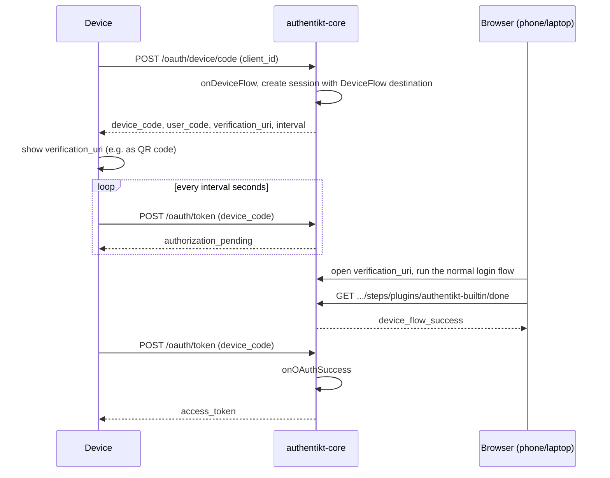

# OAuth: authorization code and device flow

authentikt can act as a small OAuth 2.0 authorization server for your own applications. It supports two grants:

- The **Authorization Code Grant** ([RFC 6749](https://datatracker.ietf.org/doc/html/rfc6749#section-4.1)) with
  **PKCE** ([RFC 7636](https://datatracker.ietf.org/doc/html/rfc7636)): a web, mobile or desktop app sends the
  browser to your login page and receives an authorization code, which it exchanges for an access token.
- The **Device Authorization Grant** ([RFC 8628](https://datatracker.ietf.org/doc/html/rfc8628)): a TV app, a CLI or
  another device without a comfortable keyboard shows a link, the user finishes the login on their phone or laptop
  with your normal authentikt login page, and the device receives an access token.

## Enabling OAuth

Add an `oauth { }` block to `installAuthentikt`, and give your `DonePlugin` an `onOAuthSuccess` callback that
creates the token:

```kotlin
val donePlugin = DonePlugin<User> {
    onSuccess { session, user ->
        // regular browser logins
    }
    onOAuthSuccess { session, user ->
        OAuthAccessToken(
            accessToken = tokenService.issueFor(user, client = session.destination!!.applicationId),
            refreshToken = null,
            expiresIn = 7.days,
        )
    }
}

installAuthentikt<User> {
    // baseUrl, uiLoginBaseUrl, plugins, authorization { ... }

    oauth {
        onAuthorize { clientId, redirectUri ->
            val client = clientRegistry.find(clientId)
                ?: return@onAuthorize OAuthAuthorizationResult.Error("Unknown client")
            if (redirectUri !in client.redirectUris) {
                return@onAuthorize OAuthAuthorizationResult.Error("Unknown redirect URI")
            }
            OAuthAuthorizationResult.Application(clientId, redirectUri, name = client.name)
        }

        onDeviceFlow { clientId ->
            if (clientId != "acme-tv-app") {
                return@onDeviceFlow OAuthDeviceFlowAuthorizationResult.Error("Unknown client")
            }
            OAuthDeviceFlowAuthorizationResult.Application(
                clientId = clientId,
                name = "ACME TV",
                deviceCode = Uuid.random().toString(),
                userCode = generateUserCode(),
            )
        }
    }
}
```

> When `oauth { }` is present, startup fails unless a `DonePlugin` with `onOAuthSuccess` is installed.
{style="note"}

The OAuth routes are mounted at the **server root** (`/oauth/...`), not under `apiPrefix`. Their errors use the
format of [RFC 6749, section 5.2](https://datatracker.ietf.org/doc/html/rfc6749#section-5.2):

```json
{ "error": "invalid_request", "error_description": "Missing client_id parameter." }
```

## Authorization code flow {id="authorization-code"}

### Configuration {id="authorization-code-configuration"}

`onAuthorize { clientId, redirectUri -> OAuthAuthorizationResult }`
: Enables `GET /oauth/authorize`. Validate the client ID and the redirect URI and return either:

- `OAuthAuthorizationResult.Application(clientId, redirectUri, name, scopes = null)`: `name` is shown on the login
  page. `redirectUri` is where the browser is sent with the code. `scopes` are the granted scopes; `null` grants all
  requested scopes, a subset grants fewer.
- `OAuthAuthorizationResult.Error(message)`: the browser is **not** redirected and receives `400` with `invalid_request`
  and the message.

Inside the block, `scopes` contains the scopes requested with the `scope` parameter.

> Only accept redirect URIs that are registered for the client. Otherwise anyone can send the authorization code of
> your users to their own server.
{style="warning"}

`authenticateClient { clientId, clientSecret -> Boolean }`
: Verifies the credentials of confidential clients at `POST /oauth/token`. Without it, only public clients that use
PKCE can use this grant, and `/oauth/authorize` rejects requests without `code_challenge`.

`authorizationCodeLifetime` (default: `1.minutes`)
: How long an authorization code can be exchanged after it was issued.

### Sequence {id="authorization-code-sequence"}



1. The client sends the browser to `GET /oauth/authorize`. authentikt calls `onAuthorize`, creates a session whose
   destination is `SessionDestination.OAuth` and redirects the browser to `uiLoginBaseUrl`.
2. The user logs in. Your step-order callback runs as usual, and you can branch on
   `session.destination is SessionDestination.OAuth`.
3. When the user reaches the `DonePlugin`, `onSuccess` is **not** called. A single-use authorization code is issued,
   the session ends, and the `DonePlugin` responds with a `redirect` to `redirect_uri?code=...&state=...`. The
   [`DoneRenderer`](frontend-renderers.md#done) follows it.
4. The client exchanges the code at `POST /oauth/token`. authentikt runs `onOAuthSuccess` and returns the token.

On the login page, `auth.currentFlow.destination` contains the application name and the granted `scopes`.

### GET /oauth/authorize

| Parameter | Required | Description |
|-----------|----------|-------------|
| `response_type` | yes | Must be `code` |
| `client_id` | yes | Passed to `onAuthorize` |
| `redirect_uri` | yes | Passed to `onAuthorize`. The token request must repeat it exactly |
| `state` | recommended | Returned unchanged with the code. Use it to protect against CSRF |
| `scope` | no | Space-separated scopes, available as `scopes` in `onAuthorize` |
| `code_challenge` | without `authenticateClient` | `BASE64URL(SHA256(code_verifier))` |
| `code_challenge_method` | with `code_challenge` | Must be `S256`. `plain` is not supported |

A missing `client_id` or `redirect_uri` and an `Error` from `onAuthorize` are answered with `400`. All other errors
are sent to the redirect URI as `redirect_uri?error=...&error_description=...&state=...`, for example
`unsupported_response_type` or `invalid_request` for a missing or invalid PKCE challenge.

### POST /oauth/token (authorization code) {id="token-authorization-code"}

Form-encoded request:

| Parameter | Value |
|-----------|-------|
| `grant_type` | `authorization_code` |
| `code` | The code from the redirect |
| `redirect_uri` | The same `redirect_uri` as in the authorization request |
| `client_id` | The client ID. Can be omitted when the client authenticates with HTTP Basic |
| `code_verifier` | The PKCE verifier, if a `code_challenge` was sent |
| `client_secret` | The client secret, if the client does not use HTTP Basic |

Confidential clients authenticate with HTTP Basic (`Authorization: Basic base64(client_id:client_secret)`) or the
`client_secret` parameter; both are checked with `authenticateClient`. A code without a PKCE challenge can only be
exchanged by an authenticated client.

Success response:

```json
{
  "access_token": "...",
  "token_type": "bearer",
  "expires_in": 604800,
  "refresh_token": null,
  "scope": "profile email"
}
```

`scope` is omitted when no scopes were granted.

| `error` | Status | Meaning |
|---------|--------|---------|
| `invalid_request` | `400` | A required parameter is missing |
| `invalid_client` | `401` | Client authentication failed or is required |
| `invalid_grant` | `400` | Unknown, expired or already used code, or `client_id`, `redirect_uri` or `code_verifier` do not match |

Every code can be presented only once, even if the request fails.

## Device flow {id="device-flow"}

### Configuration

`onDeviceFlow { clientId -> OAuthDeviceFlowAuthorizationResult }`
: Called when a device requests a code. Validate the client ID and return either:

- `OAuthDeviceFlowAuthorizationResult.Application(clientId, name, deviceCode, userCode)`: `name` is shown on the
  login page, `deviceCode` is the secret the device polls with (make it long and random), and `userCode` is a
  short code for display.
- `OAuthDeviceFlowAuthorizationResult.Error(message)`: responds with `400`, `invalid_client` and the message as
  `error_description`.

Inside the block, `generateUserCode()` returns a random six-character code made of digits 1 to 9 and upper- and
lowercase letters.

`deviceCodeLifetime` (default: `10.minutes`)
: How long the device code can be redeemed. It is sent to the device as `expires_in`. After that, the device flow
session is removed and `POST /oauth/token` answers with `expired_token`. Inactivity does not shorten this lifetime.

```kotlin
oauth {
    deviceCodeLifetime = 15.minutes
    onDeviceFlow { clientId -> /* ... */ }
}
```

### Sequence



1. The device calls `POST /oauth/device/code`. authentikt creates a session whose destination is
   `SessionDestination.DeviceFlow`.
2. The response contains a `verification_uri`. It points to `uiLoginBaseUrl` with the session ID in the query
   string, so opening it starts the login immediately. Show it as a link or QR code.
3. The user logs in. Your step-order callback runs as usual, and you can branch on
   `session.destination is SessionDestination.DeviceFlow` for stricter rules.
4. When the user reaches the `DonePlugin`, the browser gets `device_flow_success` and `onSuccess` is **not**
   called.
5. The device's next poll of `POST /oauth/token` runs `onOAuthSuccess` and returns the token. The device code can
   only be redeemed once: the session is removed afterwards.

On the login page, `auth.currentFlow.destination` contains the application name, so you can show "Signing in to
ACME TV":

```svelte
{#if auth.currentFlow?.destination.type === "device_flow"}
    <p>Signing in to <strong>{auth.currentFlow.destination.application_name}</strong></p>
{/if}
```

### Endpoints

#### POST /oauth/device/code

Form-encoded request:

| Parameter | Description |
|-----------|-------------|
| `client_id` | Client identifier, passed to `onDeviceFlow` |

Response:

```json
{
  "device_code": "1c0f8a1e-...",
  "user_code": "aB3xQ9",
  "verification_uri": "https://example.com/?_authentikt_flow_active=true&_authentikt_session_id=...",
  "verification_uri_complete": "https://example.com/?_authentikt_flow_active=true&_authentikt_session_id=...",
  "expires_in": 600,
  "interval": 5
}
```

#### POST /oauth/token (device code) {id="token-device-code"}

Form-encoded request:

| Parameter | Value |
|-----------|-------|
| `grant_type` | `urn:ietf:params:oauth:grant-type:device_code` |
| `device_code` | The `device_code` from the previous response |
| `client_id` | The same client ID |

Success response:

```json
{
  "access_token": "...",
  "token_type": "bearer",
  "expires_in": 604800,
  "refresh_token": null
}
```

Error responses (status `400`), as defined by RFC 8628:

| `error` | Meaning | What the device should do |
|---------|---------|---------------------------|
| `authorization_pending` | The user has not finished the login yet | Keep polling |
| `slow_down` | The device polled faster than the current interval | Add 5 seconds to the interval and keep polling |
| `expired_token` | Unknown device code, already redeemed, or `deviceCodeLifetime` has passed | Stop and start over |

Other grant types, and grants whose callback is not configured, are answered with `400` and
`unsupported_grant_type`. A missing parameter is answered with `invalid_request`.

### Example device client

A minimal polling client with the Ktor HTTP client. `DeviceAuthorizationResponse`, `TokenResponse` and
`OAuthErrorResponse` are your own `@Serializable` classes that mirror the JSON above:

```kotlin
val device = client.submitForm(
    url = "https://example.com/oauth/device/code",
    formParameters = parameters { append("client_id", "acme-tv-app") },
).body<DeviceAuthorizationResponse>()

println("Open ${device.verificationUriComplete ?: device.verificationUri}")

var interval = device.interval.seconds
while (true) {
    delay(interval)
    val response = client.submitForm(
        url = "https://example.com/oauth/token",
        formParameters = parameters {
            append("grant_type", "urn:ietf:params:oauth:grant-type:device_code")
            append("device_code", device.deviceCode)
            append("client_id", "acme-tv-app")
        },
    )
    if (response.status == HttpStatusCode.OK) {
        val token = response.body<TokenResponse>()
        // store token.accessToken
        break
    }
    when (response.body<OAuthErrorResponse>().error) {
        "authorization_pending" -> continue
        "slow_down" -> interval += 5.seconds
        else -> error("Device login failed")
    }
}
```
