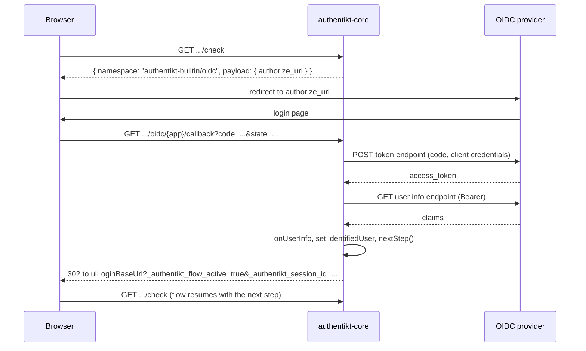

# OpenID Connect

`OIDCPlugin` identifies the user through an external OpenID Connect provider, such as Keycloak, Authentik,
Microsoft Entra ID or Google. It uses the authorization code flow, and you map the provider's user info to your own
users.

**Namespace:** `authentikt-builtin/oidc`

## Configuration

```kotlin
val oidcPlugin = OIDCPlugin<User> {
    clientId = "authentikt"
    clientSecret = System.getenv("OIDC_CLIENT_SECRET")
    authorizationEndpoint = "https://sso.example.com/realms/main/protocol/openid-connect/auth"
    tokenEndpoint = "https://sso.example.com/realms/main/protocol/openid-connect/token"
    userInfoEndpoint = "https://sso.example.com/realms/main/protocol/openid-connect/userinfo"
    scopes("openid", "profile", "email")

    onUserInfo { response, accessToken ->
        val email = response.body<JsonObject>()["email"]?.jsonPrimitive?.content
        val user = email?.let { userRepository.findByEmail(it) }
        if (user != null) UserInfo.Result.Success(user.toAuthentiktUser())
        else UserInfo.Result.Failure("No account for $email")
    }
}
```

| Property / function | Required | Description |
|---------------------|----------|-------------|
| `clientId` | yes | Client ID registered at the provider |
| `clientSecret` | yes | Client secret. It is sent in the token request body |
| `authorizationEndpoint` | yes | The provider's authorization endpoint |
| `tokenEndpoint` | yes | The provider's token endpoint |
| `userInfoEndpoint` | yes | The provider's user info endpoint |
| `scopes(vararg)` | yes | At least one scope, usually `openid` plus whatever claims you need |
| `applicationName` | no (default `"default"`) | Path segment of the callback URL. Use a distinct name per provider if you install several |
| `onUserInfo { response, accessToken -> UserInfo.Result<USER> }` | yes | Maps the provider's user info to your user |

The endpoints can be found in your provider's discovery document at `/.well-known/openid-configuration`.

> Do not hard-code the client secret. Load it from the environment or a secret store.
{style="warning"}

### Mapping user info

`onUserInfo` receives the raw Ktor `HttpResponse` of the user info request (JSON content negotiation is installed,
so `response.body<T>()` works) and the provider's access token. Return:

- `UserInfo.Result.Success(authentiktUser)` to log the user in, or
- `UserInfo.Result.Failure("reason")` to abort. The reason is logged and returned to the browser with status `401`.

This is the place to create accounts on first login (just-in-time provisioning) or to reject users who are not
allowed in.

## Registering the redirect URI

The plugin installs a callback route outside the session scope:

```
{baseUrl}{apiPrefix}/authentikt/static/plugins/authentikt-builtin/oidc/{applicationName}/callback
```

With `baseUrl = "https://example.com"`, `apiPrefix = "/api"` and the default application name, register
`https://example.com/api/authentikt/static/plugins/authentikt-builtin/oidc/default/callback` as a valid redirect URI
in your provider. The exact URL is logged at startup:

```
OIDC Callback Route for application default installed at https://example.com/api/authentikt/...
```

If the provider uses a certificate your JVM does not trust (for example a local development CA), add it with
[`customSslCert(...)`](backend-configuration.md).

## Flow



The `state` parameter carries the session ID, so the callback knows which session to continue. After the redirect
back to `uiLoginBaseUrl`, the Svelte client picks up the session from the query string and continues the flow
automatically.

## Using it in the step order

The plugin sets `session.identifiedUser`, so it replaces the email step:

```kotlin
authorization { session ->
    if (!session.has(oidcPlugin)) oidcPlugin else donePlugin
}
```

You can also combine it with local factors, for example "SSO, then TOTP".

## HTTP contract

**Payload**

```json
{ "authorize_url": "https://sso.example.com/...?client_id=...&response_type=code&scope=...&redirect_uri=...&state=..." }
```

The plugin installs no session routes. All interaction happens through the redirect and the static callback
route.

| Callback outcome | Response |
|------------------|----------|
| Success | `302` to `uiLoginBaseUrl` with flow query parameters |
| Token exchange failed | `500 Failed to exchange code for token` |
| User info request failed | `500 Failed to fetch user info` |
| `onUserInfo` returned `Failure` | `401` with the failure reason |

## Frontend

Use [`OIDCRenderer`](frontend-renderers.md#oidc). As soon as the step becomes active, it redirects the browser to
`authorize_url`. Provide a snippet if you would rather show a "Continue with SSO" button that calls
`plugin.redirect()`.
