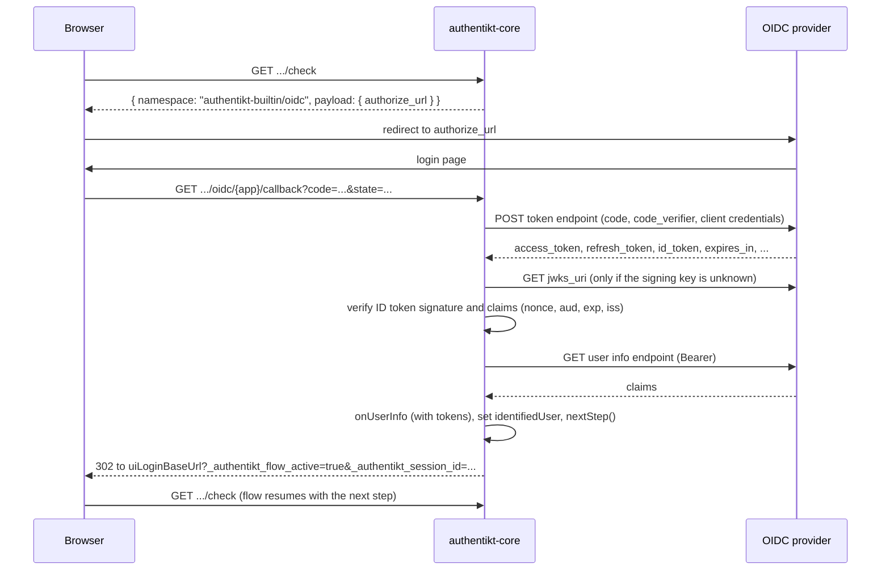

# OpenID Connect

`OIDCPlugin` identifies the user through an external OpenID Connect provider, such as Keycloak, Authentik,
Microsoft Entra ID or Google. It uses the authorization code flow, and you map the provider's user info to your own
users.

**Namespace:** `authentikt-builtin/oidc`

## Configuration

```kotlin
val oidcPlugin = OIDCPlugin<User> {
    clientId = "authentikt"
    clientSecret = System.getenv("OIDC_CLIENT_SECRET")
    authorizationEndpoint = "https://sso.example.com/realms/main/protocol/openid-connect/auth"
    tokenEndpoint = "https://sso.example.com/realms/main/protocol/openid-connect/token"
    userInfoEndpoint = "https://sso.example.com/realms/main/protocol/openid-connect/userinfo"
    issuer = "https://sso.example.com/realms/main"
    jwksUri = "https://sso.example.com/realms/main/protocol/openid-connect/certs"
    scopes("openid", "profile", "email")

    onUserInfo { response, accessToken ->
        val email = response.body<JsonObject>()["email"]?.jsonPrimitive?.content
        val user = email?.let { userRepository.findByEmail(it) }
        if (user == null) return@onUserInfo UserInfo.Result.Failure("No account for $email")

        // The full token response, e.g. to store the refresh token
        tokens.refreshToken?.let { tokenStore.save(user.id, it, tokens.expiresAt) }
        UserInfo.Result.Success(user.toAuthentiktUser())
    }
}
```

| Property / function | Required | Description |
|---------------------|----------|-------------|
| `clientId` | yes | Client ID registered at the provider |
| `clientSecret` | yes | Client secret. It is sent in the token request body |
| `authorizationEndpoint` | yes | The provider's authorization endpoint |
| `tokenEndpoint` | yes | The provider's token endpoint |
| `userInfoEndpoint` | yes | The provider's user info endpoint |
| `scopes(vararg)` | yes | At least one scope, usually `openid` plus whatever claims you need |
| `authorizationParameter(name, value)` | no | Adds an extra query parameter to the authorization URL, for example `access_type=offline` |
| `applicationName` | no (default `"default"`) | Path segment of the callback URL. Use a distinct name per provider if you install several |
| `jwksUri` | with `openid` scope | The provider's JSON Web Key Set (`jwks_uri` from the discovery document). Used to verify the signature of the ID token |
| `issuer` | no (recommended) | Expected `iss` claim of the ID token (the `issuer` from the discovery document). If unset, the issuer is not checked |
| `onUserInfo { response, accessToken -> UserInfo.Result<USER> }` | yes | Maps the provider's user info to your user. The full token response is available as `tokens` |

The endpoints can be found in your provider's discovery document at `/.well-known/openid-configuration`.

> Do not hard-code the client secret. Load it from the environment or a secret store.
{style="warning"}

### Mapping user info

`onUserInfo` receives the raw Ktor `HttpResponse` of the user info request (JSON content negotiation is installed,
so `response.body<T>()` works) and the provider's access token. The lambda runs with an `OIDCUserInfoScope` receiver,
so the complete token response is available as [`tokens`](#token-details). Return:

- `UserInfo.Result.Success(authentiktUser)` to log the user in, or
- `UserInfo.Result.Failure("reason")` to abort. The reason is logged and returned to the browser with status `401`.

This is the place to create accounts on first login (just-in-time provisioning) or to reject users who are not
allowed in.

### Token details {id="token-details"}

`tokens` is an `OIDCTokens` instance that holds everything the token endpoint returned:

| Property | Token response field | Description |
|----------|----------------------|-------------|
| `accessToken` | `access_token` | The access token. Same value as the `accessToken` parameter |
| `tokenType` | `token_type` | Usually `Bearer`, `null` if missing |
| `refreshToken` | `refresh_token` | The refresh token, `null` if the provider did not issue one |
| `idToken` | `id_token` | The encoded ID token JWT, `null` if none was issued |
| `expiresIn` | `expires_in` | Lifetime of the access token as a `Duration`, `null` if missing |
| `expiresAt` | - | `receivedAt + expiresIn`, `null` if `expiresIn` is unknown |
| `scopes` | `scope` | The granted scopes, `null` if the provider did not send them (they then equal the requested scopes) |
| `receivedAt` | - | When the response was received, taken from the configured `clock` |
| `raw` | - | The complete response as `JsonObject`, for provider-specific fields such as Keycloak's `refresh_expires_in` |

authentikt does not store, refresh or revoke these tokens; persist what you need inside `onUserInfo`. With the
`openid` scope, the ID token has already been verified when `onUserInfo` runs (see [Security](#security)); the user is
still identified through the user info endpoint. `toString()` omits
the token values so they do not end up in logs by accident.

> Refresh tokens are long-lived credentials. Store them encrypted and treat them like passwords.
{style="warning"}

### Getting a refresh token

Whether a refresh token is issued depends on the provider:

- **Keycloak** and **Authentik** issue one for the authorization code flow by default. Request `offline_access` to
  get an offline token that survives the SSO session.
- **Microsoft Entra ID** and most other providers that follow the OpenID Connect spec require the `offline_access`
  scope: `scopes("openid", "profile", "email", "offline_access")`.
- **Google** ignores `offline_access` and requires extra authorization parameters instead:

```kotlin
scopes("openid", "profile", "email")
authorizationParameter("access_type", "offline")
authorizationParameter("prompt", "consent") // otherwise Google only returns a refresh token on the first consent
```

## Registering the redirect URI

The plugin installs a callback route outside the session scope:

```
{baseUrl}{apiPrefix}/authentikt/static/plugins/authentikt-builtin/oidc/{applicationName}/callback
```

With `baseUrl = "https://example.com"`, `apiPrefix = "/api"` and the default application name, register
`https://example.com/api/authentikt/static/plugins/authentikt-builtin/oidc/default/callback` as a valid redirect URI
in your provider. The exact URL is logged at startup:

```
OIDC Callback Route for application default installed at https://example.com/api/authentikt/...
```

If the provider uses a certificate your JVM does not trust (for example a local development CA), add it with
[`customSslCert(...)`](backend-configuration.md).

## Flow



After the redirect back to `uiLoginBaseUrl`, the Svelte client picks up the session from the query string and
continues the flow automatically.

## Security

Each time the step is entered, the plugin generates three random values and stores them in the step state:

- **`state`** identifies the login attempt in the callback. It does not contain the session ID and can only be used
  once. A callback with an unknown, forged, expired or already used `state` is rejected before any request to the
  provider is made.
- **`code_verifier`** for [PKCE](https://datatracker.ietf.org/doc/html/rfc7636). The authorization request sends
  its `S256` `code_challenge`, the token request sends the verifier.
- **`nonce`**, which must be returned in the ID token.

As soon as a callback with a valid `state` and a `code` arrives, the state is consumed and replaced with fresh
values. If the login fails afterwards (for example because the token exchange or `onUserInfo` fails), the step
offers a new `authorize_url` that the user can retry with.

If the `openid` scope is requested, the token response must contain an ID token, which is validated as described in
[OpenID Connect Core, section 3.1.3.7](https://openid.net/specs/openid-connect-core-1_0.html#IDTokenValidation):

- The signature must be valid. `RS256`/`RS384`/`RS512` and `ES256`/`ES384`/`ES512` tokens are verified with the
  keys from `jwksUri`, `HS256`/`HS384`/`HS512` tokens with the `clientSecret`. Unsigned tokens (`alg: none`) and
  other algorithms are rejected.
- `nonce` must match, `aud` must contain the `clientId`, `azp` (if present) must be the `clientId`, `exp` must lie
  in the future and, if `issuer` is configured, `iss` must match. A clock difference of 30 seconds to the provider
  is tolerated.

The keys are fetched through the same HTTP client as the other provider requests (so `customSslCerts` apply) and
cached. If a token is signed with an unknown key, for example after a key rotation, they are fetched again, at most
once per minute.

The user info endpoint stays the source of the claims passed to `onUserInfo`.

> Your provider must support PKCE with `S256`. All common providers (Keycloak, Authentik, Entra ID, Google, Okta)
> do.
{style="note"}

## Using it in the step order

The plugin sets `session.identifiedUser`, so it replaces the email step:

```kotlin
authorization { session ->
    if (!session.has(oidcPlugin)) oidcPlugin else donePlugin
}
```

You can also combine it with local factors, for example "SSO, then TOTP".

## HTTP contract

**Payload**

```json
{ "authorize_url": "https://sso.example.com/...?client_id=...&response_type=code&scope=...&redirect_uri=...&state=...&code_challenge=...&code_challenge_method=S256&nonce=..." }
```

The plugin installs no session routes. All interaction happens through the redirect and the static callback
route.

| Callback outcome | Response |
|------------------|----------|
| Success | `302` to `uiLoginBaseUrl` with flow query parameters |
| `state` missing, unknown, already used, or its session expired | `400` |
| Provider returned `error` (for example `access_denied`) | `400` with the error code. The `state` stays valid, so the user can retry |
| `code` missing | `400` |
| Token exchange failed | `500 Failed to exchange code for token` |
| ID token missing or invalid (only with the `openid` scope) | `401 Invalid ID token` |
| User info request failed | `500 Failed to fetch user info` |
| `onUserInfo` returned `Failure` | `401` with the failure reason |

## Frontend

Use [`OIDCRenderer`](frontend-renderers.md#oidc). As soon as the step becomes active, it redirects the browser to
`authorize_url`. Provide a snippet if you would rather show a "Continue with SSO" button that calls
`plugin.redirect()`.
